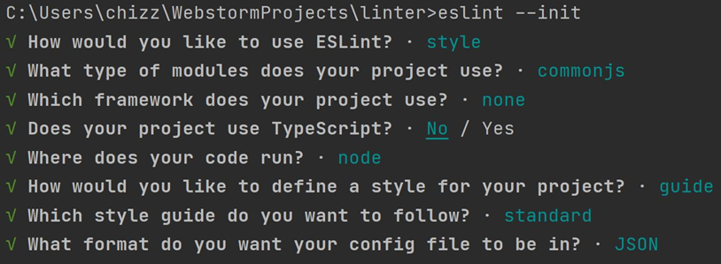

ESLint Setup Instructions
1.	Create or open a Node.js linter project. This application was developed in WebStorm.
2.	Install ESLint (via the IDE terminal) with the following command: ‘npm install eslint’.
3.	If you do not have a ‘package.json’ file in the project, then run ‘npm init’ to create one, else run ‘eslint --init’ to activate ESLint. If you execute the ‘npm init’ command, just hit enter a number f times to use the default values suggested by your system to set up the package.json file.
4.	My ESLint Initialisation options are:

5.	Open command prompt and change directory to the folder (or a parent folder) containing the target snippets and repat steps 2-4 to create a local ESLint that will be used to lint the snippets.
6.	You will now have to install a couple of modules as per the ‘required’ ones at the top of linter.js.
